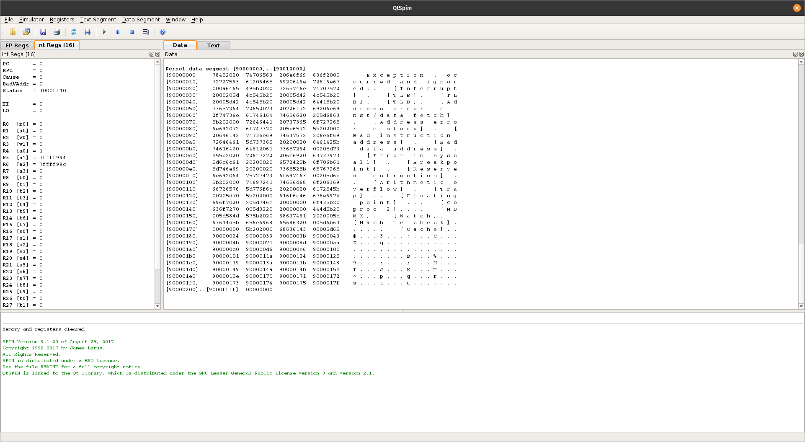
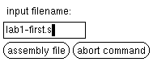
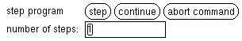
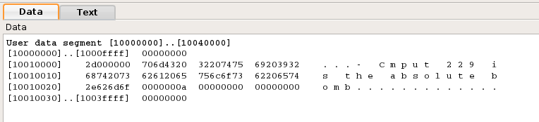

# CMPUT 229 Lab 1 - The SPIM/XSPIM Environment

## XSPIM
XSPIM is a Graphical User Interface (GUI) for the SPIM MIPS Simulator. It provides a graphical display showing assembly instructions, output, registers, and memory values to assist with writing and debugging MIPS assembly code. To launch XSPIM, simply type `xspim` in a terminal on your lab machine (or `xspim &` to keep the terminal usable while running XSPIM). While you are working in this assignment you may also want to open your favorite text editor, because you'll be answering questions as we go through.

To make it easier to write and run SPIM code on your home machine, you can install SPIM from [SourceForge](http://spimsimulator.sourceforge.net). Be warned though that all of your projects will be run on lab machines, which may not behave the exact same way as the version you install. An alternative more likely to maintain compatibility is from Mac or Linux to `ssh` to `ohaton.cs.ualberta.ca` with the `-X` flag, enabling X forwarding. For Windows, a similar effect can be achieved using PuTTY and Xming, though the process is more in-depth, and will not be discussed here. Whenever writing your code at home, you should always test your final solution on the lab machines before submitting.

  

Next, let's run our first MIPS program. First, close XSPIM and download [lab1-first.s]. Navigate your terminal to the folder with the file you just downloaded, and launch XSPIM again. Click load and the window shown below will appear. Type in `lab1-first.s` and press `assembly file`. This causes the assembly file to be loaded into XSPIM.

  

This is also a good time to note that you should never close any of XSPIM's popups except by using the `abort command` button. Trying to close a popup will cause all of XSPIM to error and terminate. Next, click `run`. A console should pop open with its output. Congratulations! you've just run your first MIPS assembly program.

**Question 1:** What was the output of the program?

Next, lets understand what's going on when the program runs. Press `reload -> assembly file` to wipe out the memory and registers changed and setup for next run, then press step.

  

When stepping through the assembly code, each instruction executed is printed at the bottom of XSPIM's main window, and the registers and data show you the internal state of the software. Changing the number of steps causes each press of the `step` button to jump forward that many instructions. Pressing `continue` causes the program to execute as if you had pressed `run`. You can step through the program now, observing how the registers change.

**Question 2:** What is the maximum value, in hex, of register `$t0` during the execution of this program?

**Question 3:** What is the value of the PC immediately before the execution of the instruction that increments register `$t0` to its maximum value?

Stepping through one more time, watch for each execution of the load word (`lw`) instruction.

**Question 4:** How many times is load word executed, and what values are loaded?

Open up [lab1-first.s] in your favorite text editor. In the data segment, the string `Number = ` is a string whose address is the label `str`. In XSPIM, while looking at the data segment find the string `Number` in memory. You may want to use an ASCII table to help identify the characters. An ASCII table is available [here](http://www.asciitable.com).

  

SPIM assumes the endianness of the machine where it is running. In the lab machine, it means that SPIM is using a little-endian layout. In a little-endian layout, the least significant byte of a number is stored in the lowest address. See the image above to see how memory addresses map to individual bytes.

**Question 5:** Write out the individual addresses of each letter in the string `Number`.

Data in memory have no inherent meaning, meaning is given solely by context. As an example we're going to interpret an instruction in code as various other types of data. Scroll using the side slider down to the instruction in Kernel Text at `0x800001C0`. The four bytes stored at that address form the binary representation of the instruction `andi $a0, $k0, 60`, but can also be interpreted in other ways.

**Question 6:** What would these four bytes represent if they were interpreted as 4 ASCII characters?

**Question 7:** What would these four bytes represent if they were interpreted as a two's complement integer?

## Directives
If you already have something loaded in XSPIM, press `clear -> memory and registers` before downloading [lab1-directives.s](resources/code/lab1-directives.s) and loading it into XSPIM. This assembly file doesn't actually do anything but quit, though it shows off many of the available data directives in MIPS. Open up the file in your text editor.

**Question 8:** For each directive (statement beginning with a period) between `.data` and `.text`, give a brief description of its purpose and where it places data in SPIM's memory when loaded (if applicable).

To assist you in answering the above question, you'll want to match values in the assembly file to values in SPIM's Data section. You'll probably also want to consult pp. A-47 to A-49 (pages B-47 to B-49 in the 4th edition) in your text book (Assembler Syntax).

## Running SPIM via Terminal
While XSPIM is very useful for debugging and visually understanding your code, sometimes you may want to run SPIM from a terminal window. To do this, you need to execute the command-line program `spim`.

To start SPIM, run an assembler file, and exit (non-interactive mode), simply run the command `spim -file ASSEMBLERFILE`, where `ASSEMBLERFILE` is the name of the file to run. This is the way to provide command-line arguments to a SPIM program and run SPIM over an SSH connection. SPIM can also be run in interactive mode, which allows debugging and breakpoints. To start SPIM interactively, just enter `spim` at a terminal. Then, to load your assembler file, type `load ASSEMBLERFILE`. To run the program type `run`. For a full list of SPIM's interactive commands, type `help`.

**Question 9:** From the interactive SPIM command line, how do you display the contents of only the register `$s0`?.

## Debugging in XSPIM
Next, download [lab1-broken.s]. Open it in your text editor to see the code and read its intended purpose, then load it in XSPIM and give it a run. While it completes successfully, it clearly is not doing what it is supposed to do. Step through the code, and track down the errors. **Write down a short description of the errors that you find in a text file called** `bugs.txt`.

## Writing A Simple Program
In this part of the assignment, you will write your first MIPS assembly program. Your program will perform endianness conversion, an operation that is commonly required when sending data over a computer network. Write a MIPS assembly program to read an integer from the terminal, invert the byte order of that integer, and then print out the new big-endian integer. For example, bytes 0 and 3 are swapped, and bytes 1 and 2 are swapped. Use any of the SPIM system calls you would like, though you may not read from or write to main memory. Refer to pages A-43 to A-45 (pages B-43 to B-45 of the 4th edition) in your textbook (System calls) for an explanation of how `syscall` functions work in SPIM. We suggest the following algorithm, though others are also correct:
* Read an integer into a register using the `read_int` syscall.
* Mask out the least significant byte, and shift it into its new position in a new register.
* Repeat the above step for the remaining 3 bytes, using or to keep the already calculated bytes.
* Print out the resulting number using the `print_int` syscall.

You only need to handle a single integer.

**Question 10:** While this program only read and flipped a single integer, usually endianness conversions need to be done over entire blocks of memory.In this question, you are **not** asked to write assembly code. Consider that you have to write a subroutine that converts the endianness of several integer numbers. For example, your subroutine could receive three parameters: the address of a *source* memory block that contains the integers to be converted, the address of a *target* memory block where the converted integers should be placed, and the *number* of integers to be converted (*source* and *target* could be the same address if the endianness conversion is to be done in place). What control structure in assembly would you need to convert an entire block of integers, given that the number of integers to be converted will only be known at runtime?

## Resources

* Example showing how to format your code is here: [example.s](resources/code/example.s).
* Slides used for in-class introduction of the lab ([.pdf](resources/slides/class.pdf))
* Slides used for in-lab introduction of the lab ([.pdf](resources/slides/lab.pdf))
* Slides used to demonstrate debugging in the lab ([.pdf](resources/slides/lab-debugging.pdf))
* Version of the program with bugs: [lab1-pres-buggy.s](resources/code/lab1-pres-buggy.s)
* Corrected version of the program: [lab1-pres-correct.s](resources/code/lab1-pres-correct.s)

## Marking Guide
Here is the [mark sheet](MarkSheet.txt) used for grading. In particular, your submission will be evaluated for:
* answering questions correctly
* correct bug fixes
* correct functionality in simple program
* program style

## Submission
There are 3 files to submit for this assignment.
* `lab1.txt`: should contain answers to the questions on this page.
* `bugs.txt`: should contain descriptions of bugs found in [lab1-broken.s].
* `lab1.s`: should contain the assembly program you wrote in the last step.

**Please make sure that you follow the link provided in the course eClass page for this lab assignment to get your own private GitHub repo for this lab. To ensure that we have the latest version of your solution, make sure to commit your changes to the repo frequently. Otherwise, you may forget to commit your latest changes by the deadline (which will count as a late lab, and will not be graded). Your solution will be automatically collected via GitHub Classroom by the deadline. Your solution MUST include the [CMPUT 229 Student Submission License](LICENSE.md) at the top of the file containing your solution and you must include your name in the appropriate place in the license text.**

[lab1-first.s]: resources/code/lab1-first.s
[lab1-broken.s]: resources/code/lab1-broken.s
